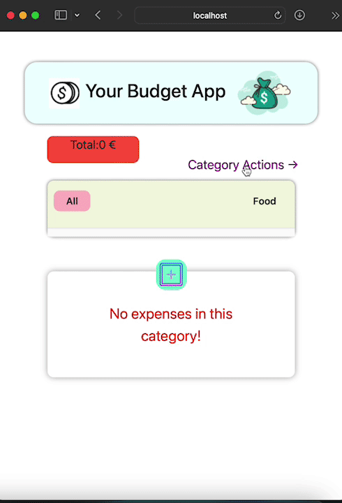

# Your Budget App

### TASKS

- React;
    * for flexibility and compability with reusable components 
        - header with different function at different pages
        - general component for error handling and getting validation from user in delete and edit functions
        - functions under utils file for input validation and date formating according to windows
    * JSX syntax
    * hooks
        . useEffect for lifecyckle methods
        . useState for tracking state in function components
        . whichPage, navigateTo hooks for different variations of components
        . useNavigate for navigating between pages or right after succesfull submiting of forms and inputs
        .useParams for retrieve route parameters from the component rendered by the matching route
    * prop-drilling for passing data between several nested childrens
- Json-server as back-end data storage
- Bootstrap, css used for designing, animated icons added
- UI: responsive web design, interactive UIs  with react
- React-router-dom for navigation between pages.

### DESCRIPTON

- A budget helping user to control expenses in different categories.
- User can;
    * list all expenses or according to category options.
    * delete or edit expenses in listexpenses component.
    * add new expenses and calculate the total amount of expenses.
    * add new categories.
    

